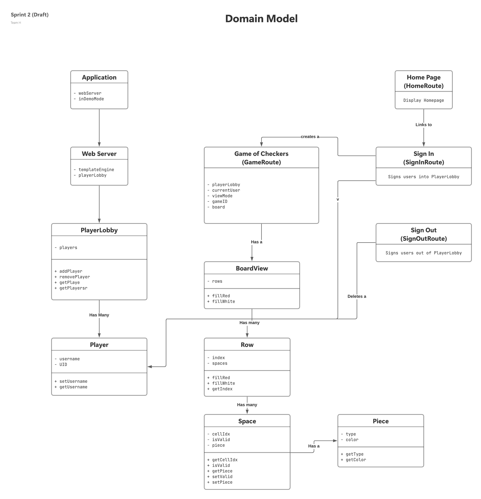
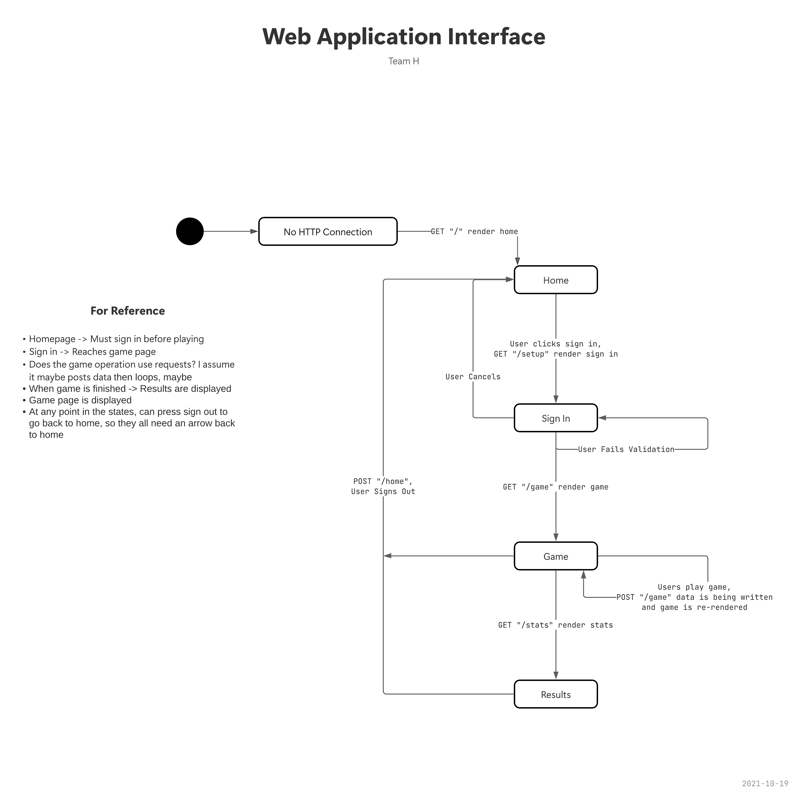
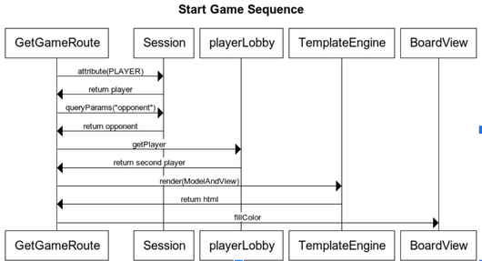

# WebCheckers Design Documentation

## Team Information

_Semester 2211, SWEN-261, Section 04, Team H_

* Anthony Swierkosz, ajs2576
* Jake Downie, jwd2488
* Ian Chasse, idc7947

## Executive Summary

WebCheckers provides players with a way to play a game of checkers against another. After signing in
with a unique name, players can spectate a game or play against each other!

### Purpose

The goal of WebCheckers is to allow multiple players to play a game of American checkers against
each other.

### Glossary and Acronyms

| Term | Definition |
|:------|:------------|
| MVP | Minimum Viable Product |
| UI | User Interface |
| A.I. | Artificial Intelligence|

## Requirements

This section describes the features of the application.

### Definition of MVP

The WebCheckers MVP should be capable of handling users and gameplay. Players must be able to sign
in, sign out, start a game with another player, and resign. The game system must enforce the
American Rules of Checkers and validate moves accordingly.

### MVP Features

#### User Handling

- Allow multiple users to sign in and be connected to a single server.
- Ensure no username is used twice.
- Allow players to resign and/or sign out.

#### Gameplay

- Allow two players to play a game of checkers against another.
- Enforce American Rules of Checkers.
- Red Player Moves First
- Alternate Players
- Validate Jump Moves

### Roadmap of Enhancements

1. Spectator Mode
2. A.I. Player
3. Enhanced UI
4. Multiple Games
5. Asynchronous Play
6. Save Game

## Application Domain

This section describes the application domain.

- Players view a homepage and then begin the sign-in process.
- Once the player is signed in to the application then they can start a game of checkers.
- A game of checkers consists of a board, a playerLobby, and other attributes like a gameID.
- The board contains rows which contains spaces, and each valid space might have a piece.
- A piece can be red or black and normal or a king.

## Architecture and Design

This section describes the application architecture.

### Summary

The following Tiers/Layers model shows a high-level view of the webapp's architecture.

As a web application, the user interacts with the system using a browser. The client-side of the UI
is composed of HTML pages with some minimal CSS for styling the page. There is also some JavaScript
that has been provided to the team by the architect.

The server-side tiers include the UI Tier that is composed of UI Controllers and Views. Controllers
are built using the Spark framework and View are built using the FreeMarker framework. The
Application and Model tiers are built using plain-old Java objects (POJOs).

Details of the components within these tiers are supplied below.

### Overview of User Interface

This section describes the web interface flow; this is how the user views and interacts with the
WebCheckers application.

The application provides the player with a view of a traditional chess board with access to submit moves, resing a game, among other things. 

The web checkers game starts with a home page that presents the
user with the ability to sign and to see how many people are playing.

After signing in you can then see a list of games and have the ability
to select a game to join. Once you are in the game you are presented with a checkers board.

### UI Tier
The main UI for the server is WebServer class that handles routing, and displaying pages. Each page is represented in a class
like GetGameRoute or GetSignInRoute. The "route" is the page that is displayed.

For handling user inputs, the Post classes are used. This is stuff like PostCheckTurnRoute and PostSignOutRoute.
These routes can also still direct users to different pages throughout the application.
> _At appropriate places as part of this narrative provide one or more
> static models (UML class structure or object diagrams) with some
> details such as critical attributes and methods._

> _If a dynamic model, such as a statechart describes a feature that is
> not mostly in this tier and cuts across multiple tiers, you can
> consider placing the narrative description of that feature in a
> separate section for describing significant features. Place this after
> you describe the design of the three tiers._

### Application Tier

The application tier handles a player lobby and a session timeout watchdog.
Both of these components are essential to the project working as desired.

The player lobby tracks what players are in the game and SessionTimeoutWatchdog tracks 
 player sessions. 

### Model Tier

Our model tier contains components that represent different game objects like the board,
player, pieces, spaces, and moves. This is important as it represents the fundamental asepcts of the game that 
make up our design. 

### Design Improvements

We need to do more trello updates, prioritization of assignments and deadlines. We need to utilize more git branches, like a branch per user story, instead of random branching.
Our code follows object-oriented programming pretty well and will be improved further on.

## Testing

Testing is preformed consistently throughout development by all developers. Testing can be done locally by opening another game 
in an incognito window that doesn't track cookies. 

### Acceptance Testing

4 user stories have passed acceptance criteria testing. A number of user stories are going to be
testing at a later date when we have more resources and complete user stories.
Our strategy for writing user stories is to keep it short, sweet, and functional.

### Unit Testing and Code Coverage

Unit tests are written before development starts in most cases unless an urgent issue needs to be resolved.
Eventually, all unit tests are to be completed and validated. User testing is done by one of the developers. 