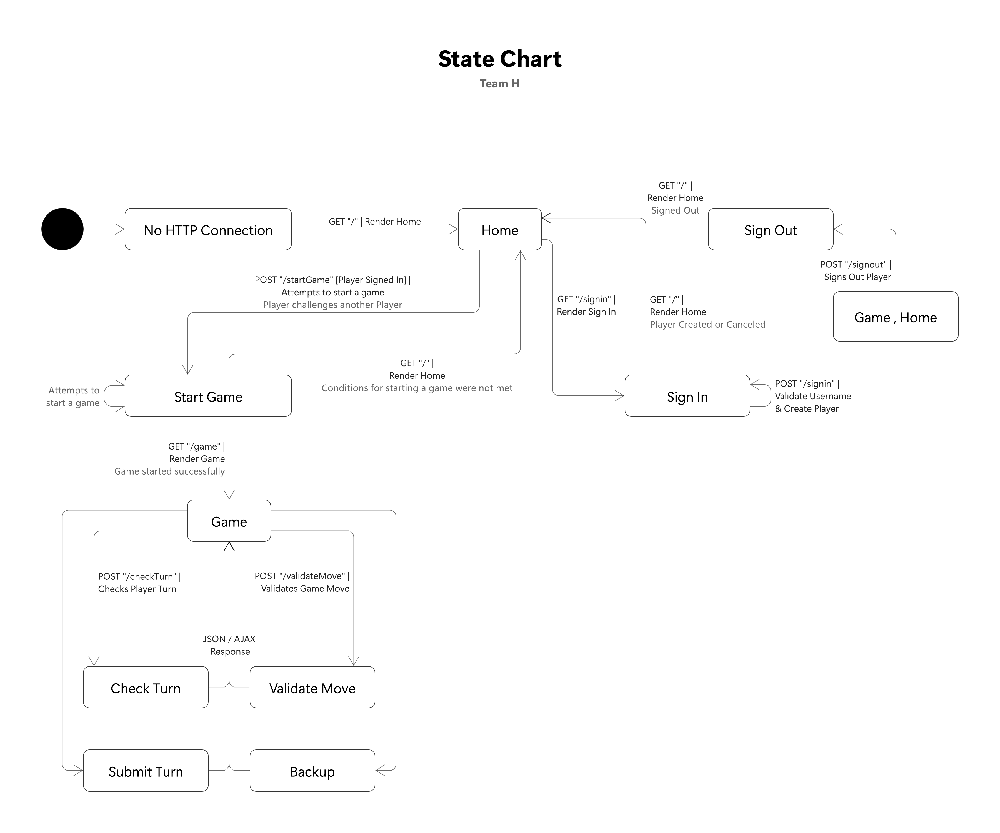

# WebCheckers Design Documentation

## Team Information

_Semester 2211, SWEN-261, Section 04, Team H_

* Anthony Swierkosz, ajs2576
* Jake Downie, jwd2488
* Ian Chasse, idc7947

## Executive Summary

WebCheckers provides players with a way to play a game of checkers against another. After signing in
with a unique name, players can spectate a game or play against each other!

### Purpose

The goal of WebCheckers is to allow multiple players to play a game of American checkers against
each other.

### Glossary and Acronyms

| Term | Definition |
|:------|:------------|
| A.I. | Artificial Intelligence |
| MVP | Minimum Viable Product |
| OO | Object Oriented |
| OS | Operating System|
| UI | User Interface |
| VO | Value Object |

## Requirements

This section describes the features of the application.

### Definition of MVP

WebCheckers MVP is capable of handling players and gameplay. Players can sign in, sign out, start a
game with another player, and resign. WebCheckers enforces the American Rules of Checkers, and moves
are validated accordingly.

### MVP Features

#### Players

- Players can sign in using a unique username
- Players can play a game of checkers against another player
- Players can sign out
- Players can resign from a game

#### Gameplay

- Allow two players to play a game of checkers against another.
- Enforce American Rules of Checkers.
- Red Player Moves First
- Alternate Players
- Validate Jump Moves

### Roadmap of Enhancements

1. Spectator Mode
2. A.I. Player
3. Enhanced UI
4. Multiple Games
5. Asynchronous Play
6. Save Game

## Application Domain

This section describes the application domain.

After a player signs in they are added to the Lobby and then able to play in games. Each game has
two players which alternatively perform moves on the board. The board validates that moves adhere to
the American Rules of Checkers. Each game has a single board containing 64 spaces which may contain
a piece.

## Architecture and Design

This section describes the application architecture.

### Summary

The following Tiers/Layers model shows a high-level view of the webapp's architecture.

As a web application, the user interacts with the system using a browser. The client-side of the UI
is composed of HTML pages with some minimal CSS for styling the page. There is also some JavaScript
that has been provided to the team by the architect.

The server-side tiers include the UI Tier that is composed of UI Controllers and Views. Controllers
are built using the Spark framework and View are built using the FreeMarker framework. The
Application and Model tiers are built using plain-old Java objects (POJOs).

Details of the components within these tiers are supplied below.

### Overview of User Interface

This section describes the web interface flow; this is how the user views and interacts with the
WebCheckers application.

The user interface is streamlined and consists of only three pages: a home, sign-in, and game page.
However, a there are a lot of states and routes that handles these three pages.

The player starts off signed out with only the ability to sign in. During sign in the user's name is
validated to ensure it is alphanumeric, once that is complete the player is now signed in.

Once player is signed in, the home page lists all other players and provides a method to start a
game with another player. The start game validates that starting a game is possible, this state is
not visible to the user.

Once a game is started the user is then taken to the game page where they are able to play a game of
checkers. While they always see the game page, various states like check turn, validate move, submit
turn, and backup handle various game functions.

### UI Tier

Each state is called a route which is handled using a GET and/or POST class. The WebServer class
handles assigning routes. For example, Sign In, has a GetSignInRoute class that handles rendering
the Sign-In page, and a PostSignInRoute class that handles writing to the model and application
tier. These routes and their respective http requests (GET/POST) are mapped in WebServer. WebServer
acts as the user entrypoint and route arbitrator dictating which UI class is used for each http
request. GET is used for rendering pages, and POST is used for handling user input.

> _At appropriate places as part of this narrative provide one or more static models (UML class structure or object diagrams) with some details such as critical attributes and methods._

> _You must also provide any dynamic models, such as statechart and sequence diagrams, as is relevant to a particular aspect of the design that you are describing. For example, in WebCheckers you might create a sequence diagram of the POST /validateMove HTTP request processing or you might show a statechart diagram if the Game component uses a state machine to manage the game._

> _If a dynamic model, such as a statechart describes a feature that is not mostly in this tier and cuts across multiple tiers, you can consider placing the narrative description of that feature in a separate section for describing significant features. Place this after you describe the design of the three tiers._

### Application Tier

The application tier handles a player lobby and a session timeout watchdog.
Both of these components are essential to the project working as desired.

The player lobby tracks what players are in the game and SessionTimeoutWatchdog tracks 
 player sessions. 

### Model Tier

Our model tier contains components that represent different game objects like the board,
player, pieces, spaces, and moves. This is important as it represents the fundamental asepcts of the game that 
make up our design. 

### Design Improvements

We need to do more trello updates, prioritization of assignments and deadlines. We need to utilize more git branches, like a branch per user story, instead of random branching.
Our code follows object-oriented programming pretty well and will be improved further on.

## Testing

Testing is preformed consistently throughout development by all developers. Testing can be done locally by opening another game 
in an incognito window that doesn't track cookies. 

### Acceptance Testing

4 user stories have passed acceptance criteria testing. A number of user stories are going to be
testing at a later date when we have more resources and complete user stories.
Our strategy for writing user stories is to keep it short, sweet, and functional.

### Unit Testing and Code Coverage

Unit tests are written before development starts in most cases unless an urgent issue needs to be resolved.
Eventually, all unit tests are to be completed and validated. User testing is done by one of the developers. 